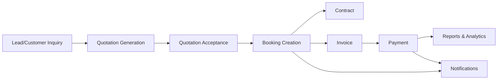
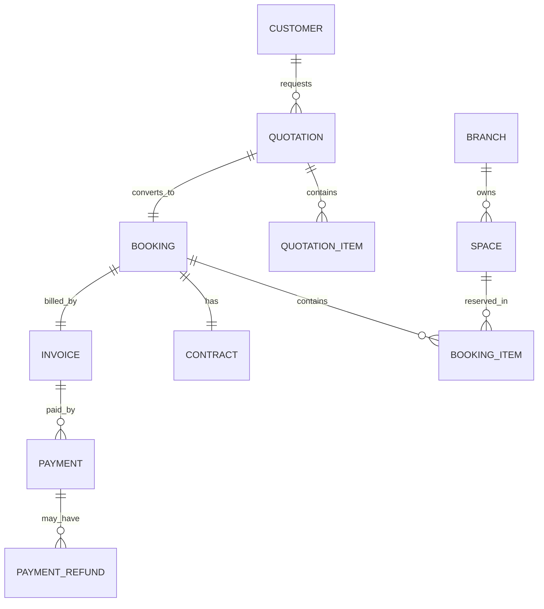
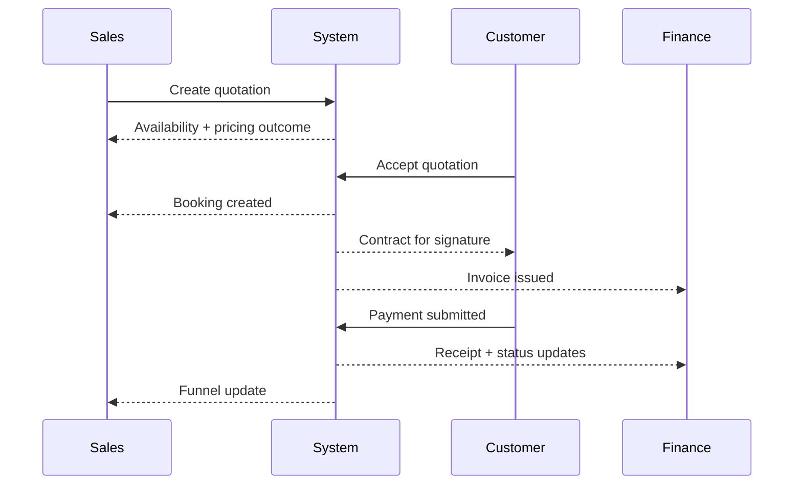

# Final Comprehensive Documentation — Smart Space Booking Platform (English)

> Executive + technical documentation for clients, leadership, and specialist teams (Backend / Web / Mobile / QA / DevOps).
>
> **Goal:** Explain the platform end-to-end in business-friendly language while preserving technical depth and architecture quality.

---

## 1) Executive Summary

**Smart Space Booking** is a SaaS platform for operating and booking spaces (halls, offices, coworking areas, storage units, etc.) with a complete lifecycle from inquiry to payment and analytics.

### Immediate business value
- Higher occupancy utilization.
- Faster sales cycle (Lead → Quotation → Booking → Payment).
- Fewer manual errors in availability, pricing, and contracts.
- Better customer journey transparency.
- Accurate operational and financial insights.

---

## 2) Project Objectives

### Business objectives
1. Centralized control of branches and spaces.
2. Flexible dynamic pricing by time/type/capacity/add-ons.
3. Reduced double-booking and conflict risk.
4. Digitized contracts, invoices, and payments.
5. Real-time operational and financial reporting.

### Engineering objectives
1. Clean, scalable architecture.
2. Modular domain design with low coupling.
3. Workflow engines over random CRUD logic.
4. API-first backend for web and mobile channels.
5. Integration-ready foundation (payments, notifications, calendars).

---

## 3) Stakeholders

- **Owner / Management:** profitability and occupancy oversight.
- **Operations Team:** branches, spaces, and booking operations.
- **Sales Team:** lead management and conversion.
- **Finance Team:** invoicing, collections, refunds.
- **Customer:** quotation review, booking, payment, signature.
- **Technical Teams:** backend, frontend, mobile, QA, DevOps.

---

## 4) System Overview

### Operating principle
- The platform is rule-driven, not data-entry-only.
- Each step has explicit status and transition criteria.

---

## 5) High-Level Architecture

### 5.1 Architecture style
- Laravel modular architecture.
- Business domains are separated into modules.
- Shared kernel for cross-domain capabilities.

### 5.2 Why this architecture?
- Parallel development across teams.
- Controlled impact radius for changes.
- Faster extensibility without deep rewrites.

### 5.3 Quality principles
- Single responsibility per service/module.
- Domain logic inside engines/services.
- Unified API response contracts.
- Explicit exception boundaries.
- Testability by design.

---

## 6) Platform Modules

| Module | Business responsibility |
|---|---|
| Auth & Users | Identity and access entry points |
| Authorization | Roles and permissions |
| Branches | Branches, working hours, branch media |
| SpaceCategories | Space taxonomy |
| Spaces | Space definitions, behavior, intelligence |
| Amenities | Facility catalog |
| Addons | Free/paid optional services |
| Customers | Customer records |
| Leads | Sales pipeline entries |
| Quotations | Dynamic quotation lifecycle |
| Bookings | Booking lifecycle and control |
| Contracts | Contract generation/signature |
| Invoices | Billing documents and items |
| Payments | Payment collection/refunds/receipts |
| Notifications | In-app and channel-ready notifications |
| Reports | Dashboard and analytics |
| ActivityLogs | End-to-end operational timeline |
| Reviews | Customer reviews |
| Favorites | Saved spaces |
| CMS | Pages and banners |
| Settings | Platform configuration |
| Media | Generic media attachment layer |

---

## 7) Core Services / Engines

| Service | Purpose |
|---|---|
| SpaceIntelligenceService | Determines operational space behavior |
| AvailabilityEngine | Conflict checks and capacity validation |
| PricingEngine | Dynamic price calculation pipeline |
| QuotationEngine | Safe quotation generation workflow |
| BookingEngine | Controlled conversion to booking |
| ContractEngine | Contract drafting and signing lifecycle |
| InvoiceEngine | Invoice issuing from booking data |
| PaymentEngine | Receive/refund/receipt + state sync |
| NotificationEngine | Event-driven notification creation |
| DashboardIntelligenceService | Operational and financial KPIs |
| ActivityLogService | Unified audit/event trace |

---

## 8) Key Entity Relations

### Conceptual relation summary
- One customer can own multiple quotations/bookings/payments.
- A quotation may convert into a booking.
- A booking leads to contract and invoice.
- An invoice may be paid in full or partially, based on policy.

---

## 9) Complete Operational Workflows

## 9.1 Sales-to-cash journey

## 9.2 Availability management
1. Requested time window and capacity are submitted.
2. Overlap checks are executed.
3. Used vs remaining capacity is computed.
4. Result is returned (available / partial / unavailable).

## 9.3 Pricing management
1. Base space price.
2. Time/type/policy multipliers.
3. Duration/promotional discounts.
4. Optional add-ons.
5. Tax and grand total.

## 9.4 Contract management
- Generate contract from booking context.
- Collect signatures.
- Move status to signed.

## 9.5 Payment management
- Register incoming payment.
- Generate receipt.
- Sync booking/invoice financial state.
- Support partial/full refunds with limits.

---

## 10) Full Process Coverage

### Customer-facing processes
- Request quotation.
- Review commercial details.
- Accept quotation.
- Track booking state.
- Sign contract.
- Pay and receive receipt.

### Operations processes
- Manage branches and spaces.
- Maintain schedules and working windows.
- Control booking lifecycle statuses.
- Manage amenities and add-ons.

### Finance processes
- Issue invoices.
- Track partial/full collections.
- Execute refunds.
- Monitor net revenue.

### Management processes
- Track occupancy.
- Track conversion pipeline.
- Track profitability.
- Compare branch performance.

---

## 11) Backend, Web, and Mobile

## 11.1 Backend
- Owns business rules, security, and integration orchestration.
- Exposes versionable APIs (V1/V2 strategy).
- Guarantees consistency via transactions and controlled status transitions.

## 11.2 Web Application
- Operational console for internal teams.
- Admin CRUD + operational screens (calendar, funnel, revenue).
- Role-based experiences.

## 11.3 Mobile Application
- Fast customer journey: request, accept, pay, track.
- Field operations experience: check-in/check-out/status updates/notifications.
- Uses the same API contracts for consistent behavior.

---

## 12) UX Expectations

### Customer
- Clear step-by-step journey.
- Transparent pricing and timing.
- Real-time status notifications.

### Staff
- Lower manual overhead.
- Task-focused operational screens.
- Validation-backed actions to reduce errors.

### Leadership
- Decision-ready KPIs instead of fragmented reporting.
- Real-time visibility into demand and performance.

---

## 13) Security & Governance

- Role-based access control.
- Policy enforcement for sensitive operations.
- Complete activity logging.
- Explicit domain exception handling.
- Strong foundation for accounting/audit compliance.

---

## 14) Performance & Scalability

### Performance practices
- Heavy domain logic isolated in services.
- Shared utilities to avoid duplication.
- Queue-ready architecture for async work (notifications/documents).

### Scalability direction
- Multi-branch, multi-city, multi-currency readiness.
- Multiple payment gateway integration.
- Multi-channel notifications.
- CRM/ERP/accounting integration adapters.

---

## 15) Testing & Quality Strategy

- Unit tests for core engines.
- Feature tests for business-critical flows.
- Edge case scenarios: overlap, partial payment, refund thresholds.
- Business UAT scenarios before production releases.

---

## 16) Suggested Delivery Roadmap

### Phase 1 (Core Operations)
- Quotation/booking/invoice/payment core lifecycle.
- Baseline dashboard KPIs.

### Phase 2 (Experience & Scale)
- Mobile-first customer workflows.
- Advanced analytics and automation.

### Phase 3 (Enterprise Integrations)
- Advanced payment gateway capabilities.
- ERP/accounting synchronization.
- AI-assisted pricing and forecasting.

---

## 17) Success KPIs

- Occupancy rate.
- Quotation-to-booking conversion.
- Average booking value.
- Payment collection cycle time.
- Refund ratio.
- Net revenue per branch.

---

## 18) Quick Glossary

- **Quotation:** Commercial offer.
- **Booking:** Reserved/confirmed transaction.
- **Invoice:** Formal billing document.
- **Refund:** Returned amount.
- **Occupancy:** Utilization rate.
- **Funnel:** Sales conversion journey.

---

## 19) Client-Facing Conclusion

This platform is designed as a **full operating system for space-based businesses**, not a basic booking screen.

It combines:
- Clear customer experience,
- Disciplined internal operations,
- Financial and operational robustness,
- Long-term scalability.

**Outcome:** a growth-ready platform with reliable metrics and enterprise-grade operational control.
